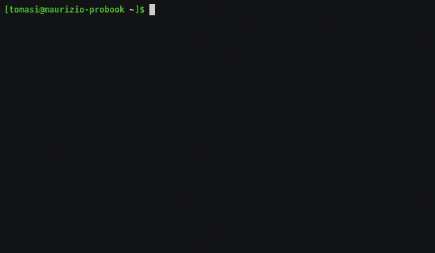

# Audiotagedit

A program to modify audio tags from the command line using your favourite editor. It uses the [TagLib](https://taglib.org/) library and can read/write tags from MP3, OGG, FLAC files, as well as any other format supported by TagLib.

# Building from sources

The program has been written using [Nim](nim-lang.org/). It uses the [TagLib](https://taglib.org/) library, which must be installed on your system.

To build the executable, install Nim and [nimble](https://github.com/nim-lang/nimble), then run the following command:

    nimble build

The name of the executable is `audiotagedit`.

# Documentation

See the [man page](./manpage.md).

# License

The program is released under the MIT license. See the file [LICENSE.md](./LICENSE.md).
